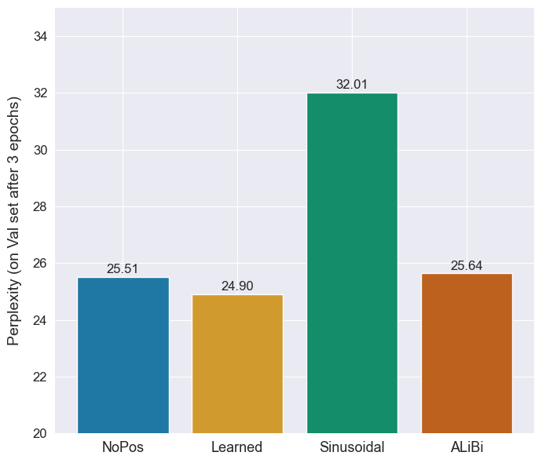
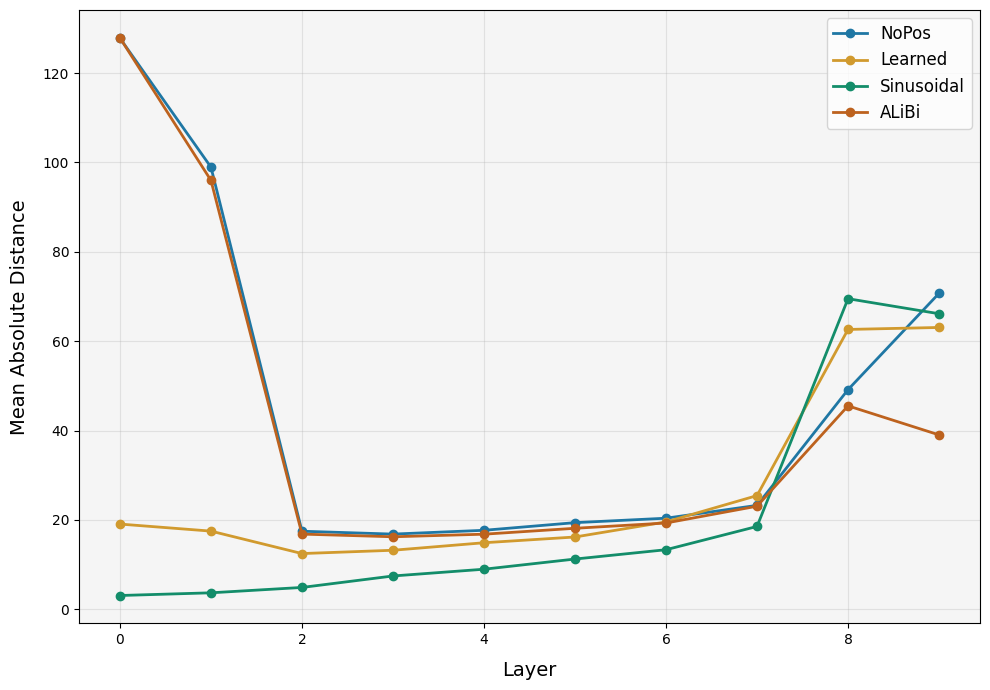

## Implementation of the paper **Transformer Language Models without Positional Encodings Still Learn Positional Information**

Course Project of Deep Learning Foundations (AI21204)

**Team Members**
- Kingshuk Patra (24AI10031)
- Shubhajeet Das (24AI10013)
- Ibtesam Ahmed (24AI10027)
- Aditya Mondal (24AI10016)
- Abhishek Kumar (24AI10007)


Implemented positional variants:
- `none` (NoPos)
- `sinusoidal`
- `learned`
- `alibi`


### Setup
Create a virtual environment and install the following dependencies: 
```bash
dependencies = [
    "datasets>=4.8.4",
    "matplotlib>=3.10.8",
    "numpy>=2.4.4",
    "pandas>=3.0.2",
    "pyyaml>=6.0.3",
    "torch>=2.1.0",
    "tqdm>=4.67.3",
    "transformers>=5.5.4",
]
```
VRAM of atleast 10GB is expected to prevent OOM / CUDA-OOM error. Else we can clone and run on **Kaggle**. To run on kaggle, we set accelerator to T4-GPU or P100 and we execute these cells:
  
  1.
```bash
!pip install -q datasets transformers pyyaml tqdm
```
  2.
```bash
!git clone https://github.com/kingshuk7995/DL-proj.git
%cd DL-proj
```


### Execution instructions
To train the model we run this script
```bash
python scripts/train.py --config configs/wikitext103.yaml
```
The checkpoints are not pushed to github due to file size limit. They can be downloaded from here: [drive link]() [NOT UPLOADED YET DUE TO SLOW INTERNET]. Paste them to ./runs .

For evaluation and generation, we can run these:
```bash
python scripts/evaluate.py --config configs/wikitext103.yaml --checkpoint runs/[exp]/checkpoints/best.pt --split test
python scripts/generate.py --config configs/wikitext103.yaml --checkpoint runs/[exp]/checkpoints/best.pt --prompt "The theory of"
```

### Description of datasets
WikiText-103 (raw-v1) - a 314M token corpus from Wikipedia articles

### Preprocessing steps
Refer to [data.py](src/experiment/data.py)
```
WikiText-103 Dataset (Raw)
    ↓
[Load with Hugging Face datasets]
    ├── train split: ~1.8M examples
    ├── validation split: ~3.7K examples
    └── test split: ~4.3K examples
    ↓
[Tokenize with GPT-2 Tokenizer]
    ├── Flatten all tokens into single stream
    ├── Add EOS token after each document
    └── Result: 1D tensor of token IDs
    ↓
[Create Overlapping Sequences]
    ├── Sequence length: 512 tokens
    ├── Stride (train): 256 tokens (50% overlap)
    ├── Stride (val/test): 512 tokens (no overlap)
    └── Example: for position i: x=tokens[i:i+512], y=tokens[i+1:i+513]
    ↓
[Batch and Load]
    ├── Batch size: 16
    ├── DataLoader with shuffle (training only)
    └── Pin memory for GPU transfer optimization
```

**CausalLMDataset**:
- Converts token stream into (x, y) pairs for teacher forcing
- x: current tokens (seq_len)
- y: next tokens (seq_len) - shifted by 1

### Execution Flows

#### **Flow 1: TRAINING** ([scripts/train.py](scripts/train.py) → [src/experiment/train.py](src/experiment/train.py))

```
Entry Point: scripts/train.py
    ↓
Parse args: --config configs/wikitext103.yaml
    ↓
load_config() → Config dataclass
    ├── Merge YAML into Config
    └── Validate/set defaults
    ↓
train(cfg)
    ↓
[INITIALIZATION PHASE]
    ├── seed_everything(cfg.seed)        # Reproducibility
    ├── device = get_device(cfg.device)  # Auto-detect GPU/CPU
    ├── Create output directories
    │   ├── runs/wikitext103_nopos/
    │   └── runs/wikitext103_nopos/checkpoints/
    ├── Setup logging
    └── Save config.json to output_dir
    ↓
[DATA LOADING]
    ├── build_dataloaders(cfg)
    │   ├── Load WikiText-103 dataset
    │   ├── Tokenize all splits
    │   ├── Create CausalLMDataset instances
    │   └── Wrap in DataLoader
    ├── Set cfg.model.vocab_size from tokenizer (50,257)
    └── Result: train_dl, val_dl, test_dl
    ↓
[MODEL & OPTIMIZER SETUP]
    ├── Create CausalTransformerLM
    │   └── Initialize with pos_encoding=cfg.model.pos_encoding
    ├── model.to(device)
    ├── criterion = CrossEntropyLoss()
    ├── optimizer = AdamW(lr=3e-4, weight_decay=0.01)
    ├── scheduler = CosineAnnealing (with warmup for 500 steps)
    └── scaler = GradScaler (for AMP - Automatic Mixed Precision)
    ↓
[RESUME FROM CHECKPOINT (optional)]
    └── If cfg.resume:
        ├── Load model_state_dict
        ├── Load optimizer_state_dict
        ├── Load scaler_state_dict
        ├── Resume from epoch/global_step/best_val
        └── Continue training
    ↓
[TRAINING LOOP] for epoch in [1, epochs]:
    ├── model.train()
    ├── optimizer.zero_grad()
    ├── For each batch in train_dl:
    │   ├── Load (x, y) to device (non_blocking=True)
    │   ├── Forward: logits = model(x)                    [shape: (B, T, vocab_size)]
    │   ├── Compute loss: CrossEntropy(logits, y)         [averaged over tokens]
    │   ├── Scale loss: loss / grad_accum                 [gradient accumulation]
    │   ├── scaler.scale(loss).backward()
    │   ├── Every grad_accum steps:
    │   │   ├── Clip gradients (max norm=1.0)
    │   │   ├── scaler.step(optimizer)
    │   │   ├── scheduler.step()
    │   │   └── global_step += 1
    │   ├── Update running metrics
    │   └── Log every 50 steps (train_loss, train_ppl)
    │
    ├── Epoch complete: Compute final train_loss, train_ppl
    │
    ├── [VALIDATION PHASE]
    │   ├── model.eval()
    │   ├── torch.no_grad():
    │   │   ├── For each batch in val_dl:
    │   │   │   ├── logits = model(x)
    │   │   │   └── Accumulate loss
    │   │   ├── val_loss = total_loss / total_tokens
    │   │   └── val_ppl = exp(val_loss)
    │   └── Log validation metrics
    │
    ├── [CHECKPOINTING]
    │   ├── Save last.pt (always)
    │   │   └── Contains: model_state, optimizer_state, scaler_state,
    │   │              epoch, global_step, cfg
    │   ├── If val_loss < best_val:
    │   │   ├── Update best_val
    │   │   └── Save best.pt
    │   └── Result: runs/wikitext103_nopos/checkpoints/{best.pt, last.pt}
    │
    └── Append to history: {epoch, train_loss, train_ppl, val_loss, val_ppl}
    ↓
[POST-TRAINING]
    └── Result: ./runs/wikitext103_nopos/
        ├── config.json
        └── checkpoints/
            ├── best.pt     (best validation checkpoint)
            └── last.pt     (final epoch checkpoint)
```

**Causal Masking**: Attention can only look at past tokens (causal_mask)

---

#### **Flow 2: EVALUATION** ([scripts/evaluate.py](scripts/evaluate.py) → [src/experiment/evaluate.py](src/experiment/evaluate.py))

```
Entry Point: scripts/evaluate.py
    ↓
Parse args:
    ├── --config configs/wikitext103.yaml
    ├── --checkpoint runs/exp/checkpoints/best.pt
    └── --split test (train/val/test)
    ↓
evaluate_checkpoint(cfg, checkpoint_path, split)
    ↓
[SETUP]
    ├── load_config(cfg_path)
    ├── build_dataloaders(cfg)
    ├── Create CausalTransformerLM (same architecture)
    ├── Load checkpoint: model.load_state_dict(ckpt['model_state'])
    └── criterion = CrossEntropyLoss()
    ↓
[STANDARD METRICS]
    ├── evaluate(model, dataloader, criterion, device)  [from train.py]
    ├── model.eval()
    ├── For each batch (no_grad):
    │   ├── logits = model(x)
    │   ├── loss = CrossEntropy(logits, y)
    │   └── Accumulate
    ├── avg_loss = total_loss / total_tokens
    ├── perplexity = exp(avg_loss)
    └── Return: {loss, ppl}
    ↓
[LAYERWISE ANALYSIS - Key for paper]
    ├── _evaluate_layerwise(model, dataloader)
    ├── For each batch:
    │   ├── logits, hidden_states = model(x, return_hidden_states=True)
    │   │   └── Returns outputs from each layer (including embeddings and final)
    │   ├── positions = [0, 1, 2, ..., T-1]
    │   └── Collect features for regression
    │
    ├── For each layer l in [0, n_layers+1]:
    │   ├── X = all_hidden_states[l]              [shape: (N*T, d_model)]
    │   ├── y = all_positions                      [shape: (N*T,)]
    │   ├── Linear regression: X_aug @ w = y
    │   │   └── X_aug = [X | ones]  (bias term)
    │   ├── y_pred = X_aug @ w
    │   ├── MAE = mean(|y_pred - y|)
    │   └── layer_mae[l] = MAE
    │
    └── Return: layer_mae                [measures how well position is encoded]
    ↓
[OUTPUT]
    ├── Print metrics:
    │   ├── loss: 6.2314
    │   ├── ppl: 505.23
    │   └── layerwise: [32.1, 28.3, 24.5, ..., 18.2]
```
---

#### **Flow 3: GENERATION** ([scripts/generate.py](scripts/generate.py) → [src/experiment/generation.py](src/experiment/generation.py))

```
Entry Point: scripts/generate.py
    ↓
Parse args:
    ├── --config configs/wikitext103.yaml
    ├── --checkpoint runs/exp/checkpoints/best.pt
    ├── --prompt "The theory of"
    ├── --max_new_tokens 50
    ├── --temperature 1.0
    └── --top_k 50
    ↓
[SETUP]
    ├── load_config()
    ├── build_dataloaders() [for tokenizer only]
    ├── Create model, load checkpoint
    └── device = auto-detect
    ↓
generate(model, tokenizer, prompt, ...)
    ├── model.eval()
    ├── Tokenize prompt: input_ids = tokenizer(prompt)
    │   └── Shape: (1, prompt_len)
    │
    ├── [AUTOREGRESSIVE LOOP] for step in range(max_new_tokens):
    │   ├── logits = model(input_ids)           [shape: (1, seq_len, vocab_size)]
    │   ├── next_logits = logits[:, -1, :]      [last token logits]
    │   ├── Scale by temperature: logits / temperature
    │   ├── Apply top_k filtering
    │   │   └── Keep only top_k probabilities, zero out rest
    │   ├── probs = softmax(next_logits)
    │   ├── next_id = sample(probs, num_samples=1)
    │   ├── input_ids = [input_ids | next_id]
    │   └── Sequence grows by 1 token each step
    │
    └── Return: tokenizer.decode(input_ids)    [convert back to text]
    ↓
[OUTPUT EXAMPLE]
    Input:  "The theory of"
    Output: "The theory of knowledge and belief is a central concern
             of epistemology. Epistemology is the branch of philosophy
             that studies knowledge..."
```

**Sampling Strategy**:
- **Top-K**: Filter to top_k=50 tokens by probability
- **Temperature**: Controls randomness
  - T=0.0: Argmax (deterministic, greedy)
  - T=1.0: Standard softmax
  - T>1.0: Flatter distribution (more random)


### Experimental results
Results can be found on [results_analysis.ipynb](result_analysis.ipynb).


